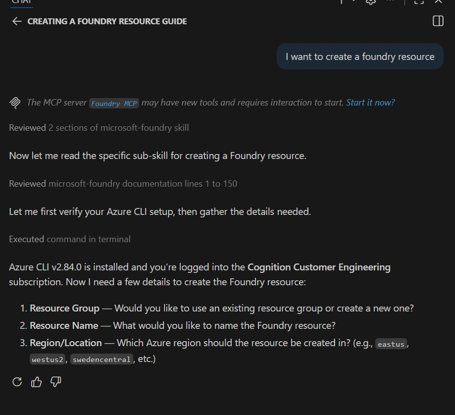
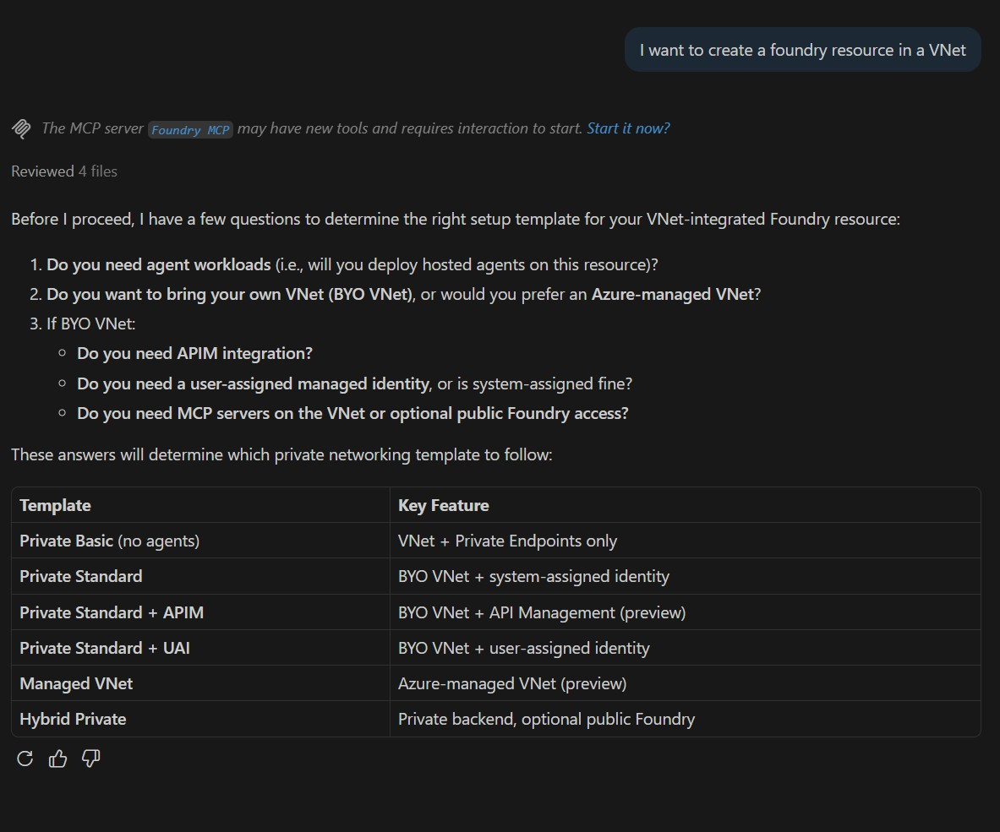
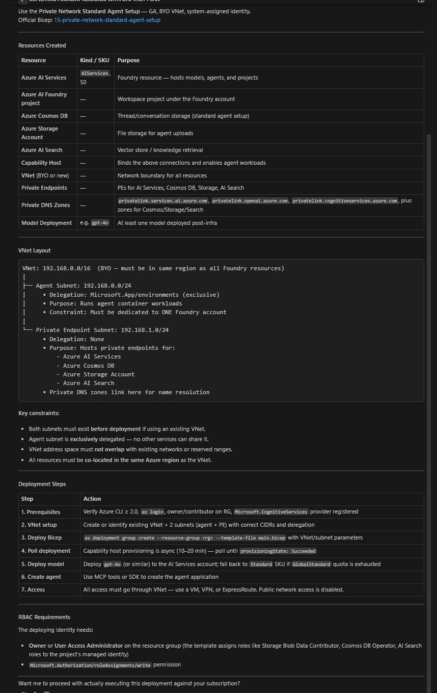
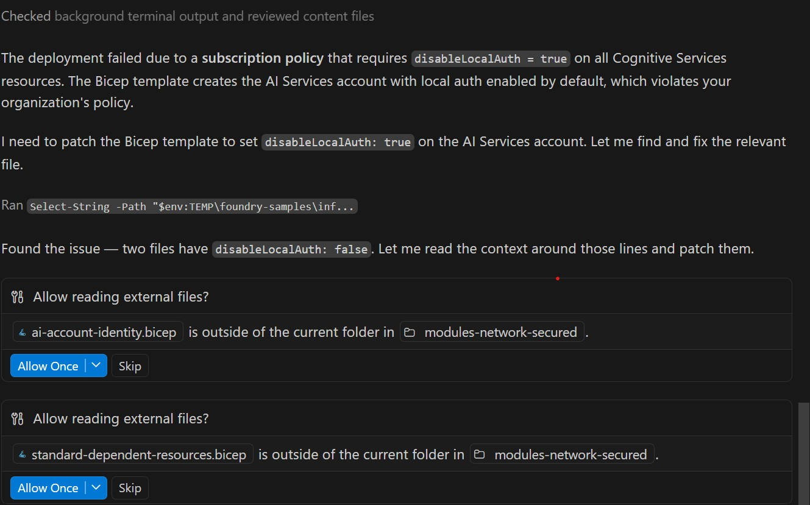
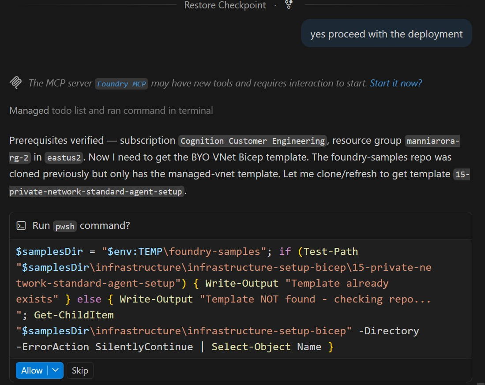

# Findings

**Testing Tool:** GitHub Copilot (GHCP) with Claude Opus 4.6

---

## Finding 1: Ambiguous "Create Foundry" Intent Maps Directly to Project Creation

**Scenario:** User says "I want to create Foundry" without specifying whether they mean a Foundry *resource* or a Foundry *project*.

**Observed Behavior:** The skill immediately maps the request to creating a Foundry project — without asking for clarification or confirmation.

**Issue:** The user's actual intent was to create a Foundry *resource*, not a Foundry *project*. The skill should either:
- Ask for confirmation/disambiguation before proceeding, or
- Present the available options (e.g., "Did you mean create a Foundry resource or a Foundry project?")

**Screenshot:**

**Expected Behavior (TBD):** Unclear what the intended design is, but at minimum a confirmation step seems warranted when the request is ambiguous.

**References:**
- Skill file: [.github/skills/microsoft-foundry/project/create/create-foundry-project.md](.github/skills/microsoft-foundry/project/create/create-foundry-project.md)
- Skill entry point: [.github/skills/microsoft-foundry/SKILL.md](.github/skills/microsoft-foundry/SKILL.md)

---

## Finding 2: Create Foundry Resource Asks Three Initial Questions

**Scenario:** User says "I want to create a foundry resource."

**Observed Behavior:** The skill correctly identifies the intent to create a Foundry resource and asks three questions before proceeding:

1. **Resource Group** — Use an existing resource group or create a new one
2. **Resource Name** — Name for the Foundry resource
3. **Region/Location** — Azure region to create the resource in

**Screenshot:**

**Assessment:** This is reasonable behavior. The three questions align with the required parameters for `az cognitiveservices account create` and match the workflow defined in the skill's resource/create sub-skill.

**References:**
- Skill file: [.github/skills/microsoft-foundry/resource/create/create-foundry-resource.md](.github/skills/microsoft-foundry/resource/create/create-foundry-resource.md)

---

## Finding 3: VNet Questionnaire Question 1 — "Agent Workloads" Term May Confuse Customers

**Scenario:** User is going through the VNet/networking questionnaire when creating a Foundry resource with private networking.

**Observed Behavior:** The first routing question asks: **"Does the user need agent workloads?"** and then asks about hosted agents. Many customers may not understand the distinction between "hosted agents" (Foundry hosted agent applications) and other types of agents (e.g., Azure DevOps pipeline agents, AI agents in general, etc.).

**Screenshot:**

**Issue:** The term "agent workloads" and "hosted agents" is overloaded in the Azure ecosystem. Customers unfamiliar with Foundry-specific terminology may:
- Confuse Foundry hosted agents with Azure DevOps hosted build agents.
- Not understand what "agent workloads" means in this context.
- Make an incorrect selection, leading to the wrong infrastructure template being applied (e.g., choosing "Private Basic (no agents)" when they actually need agent support, or vice versa).

**Expected Behavior:** The skill should provide brief clarification or context when asking this question — for example:
- "Do you need to run Foundry hosted agent applications (custom AI agent code deployed as containers)?"
- Include a short tooltip or explanation distinguishing Foundry hosted agents from other agent concepts.

**References:**
- Skill routing logic: [.github/skills/microsoft-foundry/SKILL.md](.github/skills/microsoft-foundry/SKILL.md) (lines 90–95, VNet routing questions)
- Foundry Hosted Agents docs: https://learn.microsoft.com/azure/ai-foundry/agents/concepts/hosted-agents

---

## Finding 4: Skill Clones the Foundry Samples Repository

**Scenario:** During skill execution, the skill attempts to clone the `microsoft-foundry/foundry-samples` GitHub repository.

**Observed Behavior:** The skill runs a `git clone` of the `foundry-samples` repo into the user's temp directory as part of its workflow. This is a network-dependent operation that fetches external content at runtime.

**Screenshot:**

**Issue:** This clone step could be a blocker in several scenarios:
- **Air-gapped / restricted networks:** Enterprise environments behind firewalls or with no external internet access will fail at this step.
- **GitHub rate limits:** Users without GitHub authentication may hit rate limits, especially in shared environments or CI/CD pipelines.
- **Latency / reliability:** Cloning adds latency and introduces a dependency on GitHub availability. If GitHub is down or slow, the skill stalls.
- **Security concerns:** Some organizations restrict cloning from external repositories as a policy, which would block this entirely.

**Question:** Can this clone step be skipped or made optional? If the skill only needs specific templates or files from the repo, those could be bundled with the skill itself or fetched on-demand with a fallback mechanism.

**Expected Behavior:** The skill should either:
- Bundle the required files/templates directly so no external clone is needed, or
- Make the clone step optional with a graceful fallback if the repo is unavailable, or
- Clearly inform the user that internet access to GitHub is required before attempting the clone.

---

## Finding 5: Explicit Plan Request Generates Plan Without Clarifying Questions

**Scenario:** User explicitly asks the skill to generate a plan (e.g., for BYO VNet setup).

**Observed Behavior:** When the user explicitly requests a plan, the skill immediately produces a full plan without asking any clarifying questions first. It skips the usual question-gathering phase and jumps straight to outputting a step-by-step plan.

**Screenshot:**

**Issue:** While generating a plan quickly can be useful, skipping clarifying questions means the plan may be based on assumptions rather than the user's actual environment and requirements. For example:
- The plan may assume default resource names, regions, or configurations that don't match the user's intent.
- The user may have existing infrastructure (e.g., an existing VNet, subnets, or NSGs) that the plan doesn't account for.
- Without understanding the user's constraints (e.g., naming conventions, compliance requirements, existing resources), the generated plan may need significant revision.

**Expected Behavior:** Even when explicitly asked for a plan, the skill should either:
- Ask a minimal set of clarifying questions to tailor the plan to the user's environment, or
- Clearly state the assumptions the plan is based on and prompt the user to confirm or adjust before proceeding.

---

## Finding 6: Skill Modifies Cloned Samples Repo to Fulfill User Requirements

**Scenario:** After cloning the `foundry-samples` repository (Finding 4), the skill proceeds to modify the cloned Bicep templates in-place to satisfy user requirements.

**Observed Behavior:** When the user specifies requirements (e.g., `disableLocalAuth` should be set), the skill directly edits the Bicep files inside the cloned `foundry-samples` repo in the user's temp directory. It treats the samples repo as a working template, patching parameters and resource properties to match what the user asked for.

**Screenshots:**

**Issues:**

1. **User does not own the output:** The modified files live inside a cloned third-party samples repo in a temp directory. The user has no clear ownership or visibility into what was changed. If the user needs to version-control, review, or customize the infrastructure code further, they are working inside someone else's repo structure — not their own project.

2. **No IaC format preference asked:** The skill assumes Bicep without ever asking the user whether they prefer **Bicep** or **Terraform** (or another IaC tool). Many organizations have standardized on Terraform, and generating Bicep without asking could produce output that doesn't fit the user's workflow or toolchain.

3. **Fragile patching approach:** Modifying sample templates in-place is brittle. If the samples repo structure changes upstream, the skill's patching logic may break. The user also has no guarantee that the modified template is complete or correct — it's a patched sample, not a purpose-built template.

4. **Unclear provenance:** If the user later needs to troubleshoot or audit the infrastructure code, the lineage is unclear — it's a sample template with ad-hoc modifications, not a clean template generated for their specific requirements.

**Expected Behavior:** The skill should:
- **Ask the user's preferred IaC format** (Bicep, Terraform, etc.) before generating infrastructure code.
- **Generate or scaffold templates in the user's own workspace**, not inside a cloned samples repo in a temp directory.
- If samples are used as a starting point, **copy the relevant files into the user's project** rather than editing them in-place in the cloned repo.
- Clearly communicate what files were created/modified and where, so the user can review and take ownership.
