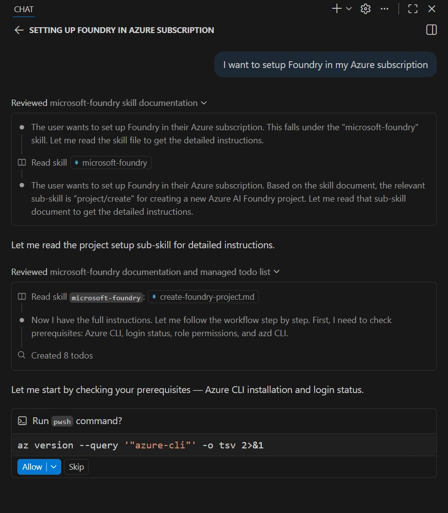
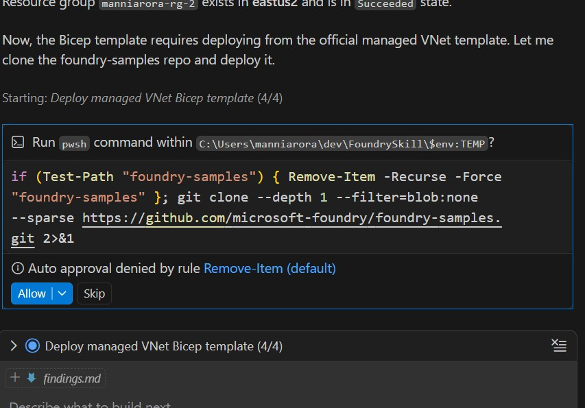
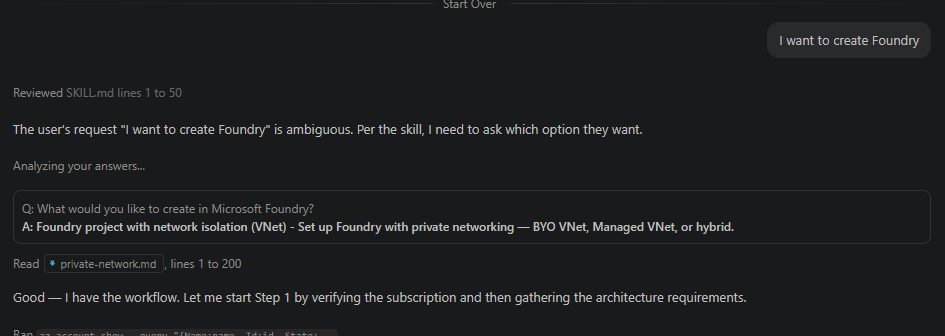
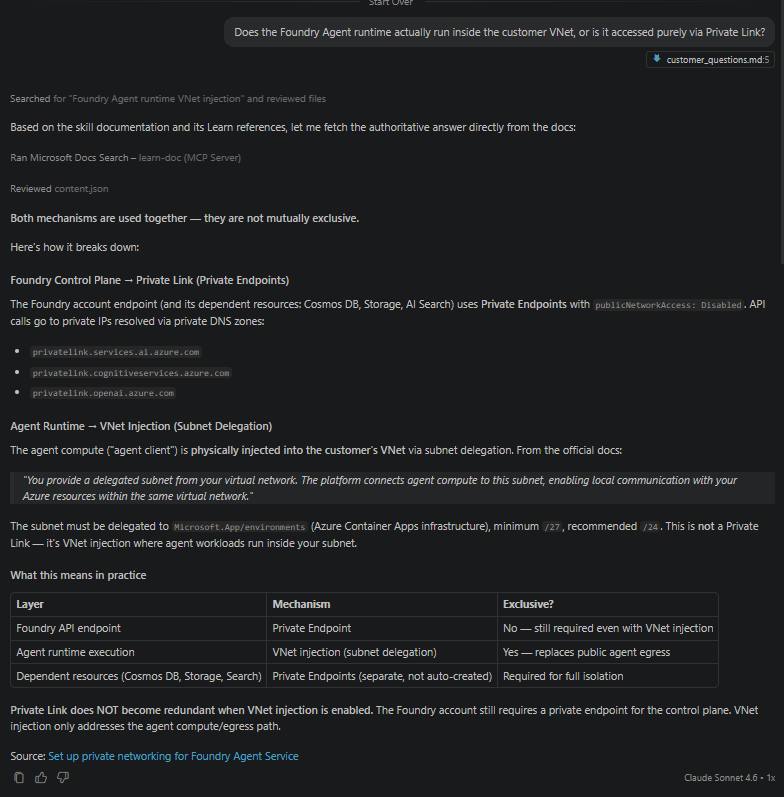
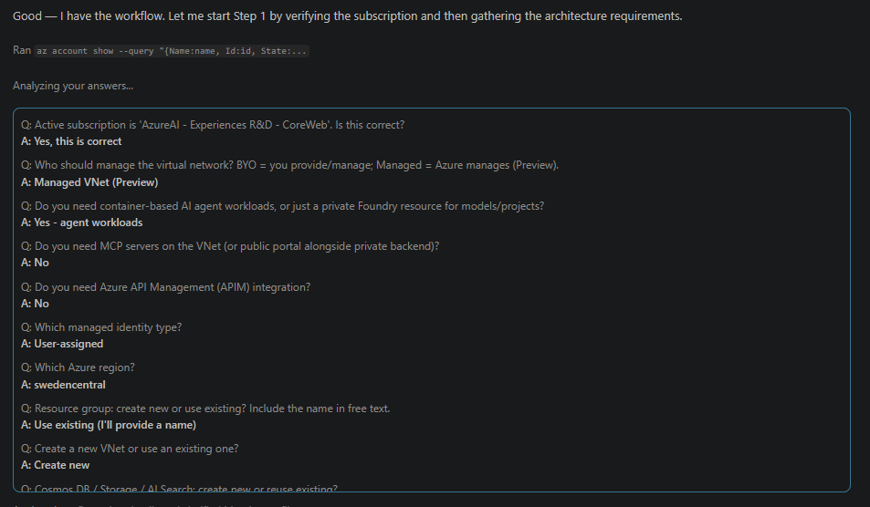
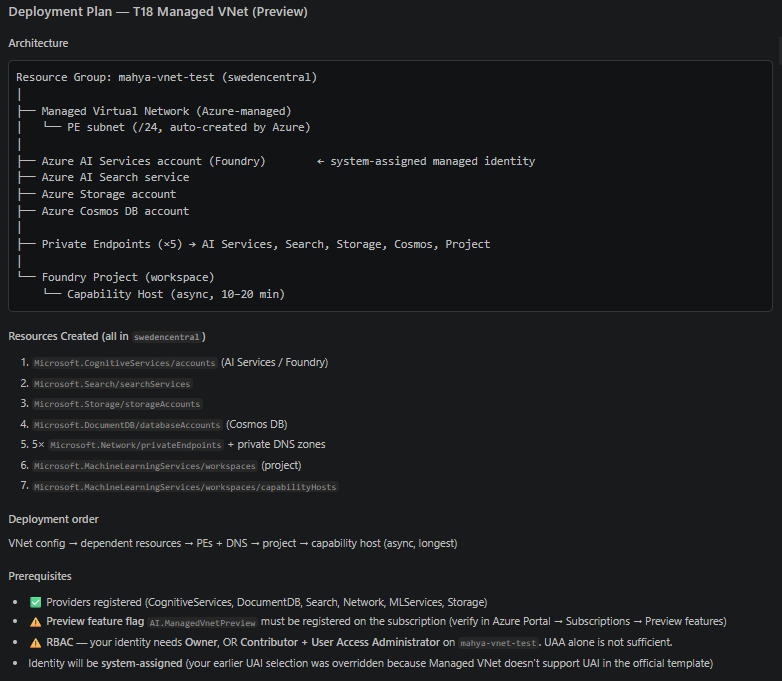
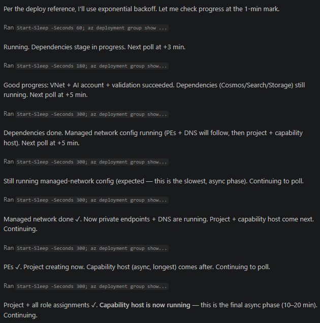

# VNet Skill — Changes Review

---

## Background

Two parallel skill efforts existed for Foundry private networking:

1. **General Q&A skill** — Answers customer questions about Foundry networking concepts: VNet isolation patterns, private endpoints, subnet delegation, DNS, firewall rules, etc.
2. **Deployment skill** (part of `microsoft-foundry`) — Guides users through deploying Foundry infrastructure using official Bicep templates, including 7 templates covering public, BYO VNet, Managed VNet, APIM, UAI, and hybrid patterns.

We took both skills and tested them across three areas before making changes.

---

## Testing

| Area | Method | Focus |
|------|--------|-------|
| **Overall skill functionality** | Static analysis of all skill documents + prompt testing sessions | Routing accuracy, requirement gathering, plan generation, and general question handling |
| **Managed VNet deployment** | 5 live chat sessions targeting the Managed VNet (preview) path | End-to-end flow from first prompt to deployed infrastructure |
| **BYO VNet deployment** | Live deployment against a real Azure subscription with multiple models (GPT-4.1, Mistral-Large-3, Llama-3.3) | Full `az deployment group create` lifecycle including error recovery |

---

## Issues Found

No test session completed an end-to-end deployment without manual intervention.

| Issue | Customer Impact |
|-------|----------------|
| Agent pre-selects a template by reading filenames before asking routing questions | User ends up on the wrong infrastructure path — entire session wasted |
| BYO VNet vs Managed VNet question missing or asked incorrectly | Wrong template selected in 2 of 5 sessions — fundamentally different architectures deployed |
| Irrelevant questions asked (e.g., "hosted vs prompt agent") | Confuses the user; agent type has no bearing on infrastructure template |
| No structured requirement gathering for VNet-specific inputs | DNS, VPN/ExpressRoute, firewall, Azure Policy, subnet details never collected — failures discovered at deploy time |
| No pre-deployment validation (RBAC, Policy, quota, providers) | Preventable failures after 15–20 min wait; `disableLocalAuth` policy violation hit in live test |
| No `what-if` dry run before deploying | Policy violations and parameter errors only surfaced after failed deployment |
| Templates don't enumerate what resources they create | User approves deployment without knowing what will be provisioned |
| No confirmation checkpoint between plan and deployment | Agent jumps straight to deploying — no opportunity for user to review |
| Agent polls deployment status every 15–30 seconds | 75% of turns wasted with no status change during 20-min capability host provisioning |
| Wrong GitHub organization URL in 14 files | Template fetch fails; agent retries with wrong URL before finding the correct one |
| Templates re-cloned from GitHub even when already in workspace | Unnecessary network dependency and wasted turns |
| Fictitious model name (`gpt-5.3`) in template docs | User tries to deploy a model that doesn't exist |
| Non-OpenAI model versions use integer format, not date strings | `DeploymentModelNotSupported` failure — Mistral/Meta versions are `1`, `9`, not date strings |
| Orphaned subnet service link on failed retry | Reusing VNet name after a failed deployment causes permanent subnet lockout |
| RBAC prerequisite is wrong ("Owner OR UAA") | `AuthorizationFailed` — correct minimum is Owner, or Contributor + UAA |
| `Azure AI Developer` and `Azure AI User` roles not documented | User can't create or manage agents after successful deployment |
| `Azure AI User` must be at project scope, not account scope | Data-plane agent operations fail even with correct role at wrong scope |
| No guidance on reaching private endpoints after deployment | Agent endpoint is private by design but no VPN/Bastion/ExpressRoute guidance provided |
| Correct token audience (`https://ai.azure.com`) undocumented | Authentication fails with wrong audience — easy to guess wrong |
| Skill modifies cloned samples in temp directory | User has no ownership of the generated code; fragile patching approach |
| No IaC format preference asked | Skill assumes Bicep — many enterprises standardize on Terraform |

---

## What We Changed

### Scope of Changes

Our changes focus on the **default official Bicep templates** — the "happy path" where users deploy Foundry using the standard templates as-is or with parameter adjustments. User-specific scenarios (existing IaC, Terraform translation, hub-spoke integration, cross-subscription) can span multiple aspects and still need more testing. The skill can adapt templates based on user-provided information (e.g., existing VNet, custom CIDRs, Azure Policy requirements), but fully custom scenarios are flagged as requiring manual ownership.

### New Skill: `private-network` Sub-Skill

We created a dedicated `private-network` sub-skill that handles both **general Q&A** and **deployment**. For question answering, the skill grounds every response in **Microsoft Learn** documentation — it searches and fetches official docs before answering, and explicitly states when Learn doesn't cover a topic rather than inventing facts. For deployment, it follows a structured 6-step workflow:

| Step | What It Does |
|------|-------------|
| **Ground in Learn** | Search Microsoft Learn before answering any networking question — never invent facts |
| **Information Gathering** | Verify subscription, ask architecture questions, collect deployment inputs, validate region, match to template |
| **Requirement Gathering** | Enterprise intake: VNet topology, DNS, firewall, identity, model versions, access paths, IaC preferences, Azure Policy |
| **Plan Generation** | Present architecture overview, resource list, RBAC prereqs, DNS zones, deployment order — get user confirmation |
| **Scaffold & Parameterize** | Fetch template (entire folder including modules), wire parameters from gathered inputs |
| **Pre-Deployment Validation** | RBAC, Azure Policy (`what-if`), quota, provider registrations, feature flags, sovereign cloud check |
| **Deploy & Track** | Deploy with exponential backoff polling (1m → 3m → 5m), error recovery with known failure mapping |
| **Post-Deployment Validation** | PE verification, DNS resolution, RBAC audit, public access audit, end-to-end agent lifecycle test |

Each step is a separate reference document to stay within token budgets.

### Key Improvements

**Deterministic routing** — Hard stop directive prevents the agent from reading any template document until routing questions are complete. Prescriptive questions with exact wording and a deterministic routing table replace the previous ad-hoc approach.

**Microsoft Learn grounding** — The skill uses `microsoft_docs_search` and `microsoft_docs_fetch` tools to ground every answer about VNet configuration, private endpoints, or managed VNet in official documentation. If Learn doesn't cover a topic, the skill says so explicitly.

**Structured requirement gathering** — Two-stage process collects all VNet-specific inputs before deployment: architecture decisions first, then enterprise requirements (DNS, firewall, on-prem connectivity, Azure Policy, model versions, IaC preferences). A compatibility gate catches unsupported combinations early.

**Plan with architecture overview** — Agent presents a full architecture diagram with VNet layout, resource list, RBAC prereqs, DNS zones, and deployment order using the user's actual values, and waits for confirmation before proceeding.

**Pre-deployment validation** — Mandatory `what-if` dry run, RBAC check, quota verification, provider registration check, and feature flag validation — all before deploying.

**Efficient deployment tracking** — Exponential backoff polling replaces the 15-second polling loop. Known error mapping guides recovery for common failures (policy violations, wrong model versions, orphaned subnets).

**Complete post-deployment pipeline** — PE verification, DNS resolution checks, RBAC audit (including project-scope `Azure AI User`), model deployment, and a 3-phase end-to-end test (network validation, agent lifecycle across all 4 PEs, isolation proof with VPN off).

**VPN + DNS access setup** — Bundled Bicep template for point-to-site VPN Gateway + DNS Private Resolver so users can connect to private endpoints from their dev machine.

**Bug fixes** — Removed fictitious model, corrected RBAC prerequisites, fixed Bicep compile error.

---

## Validation

After implementing changes, we ran a full end-to-end Managed VNet deployment:

| Area | Before | After |
|------|--------|-------|
| Template routing | Wrong in 2/5 sessions | Correct — routing questions asked first |
| Pre-deployment validation | RBAC 1/5, Policy 0/5, Quota 0/5 | All checks passed before deploying |
| `what-if` dry run | Never used | Ran before every deployment |
| Polling efficiency | 20 polls, 75% wasted | Exponential backoff |
| Architecture overview | Never shown | Full layout + resource list presented |
| End-to-end agent test | Never reached | All 4 PEs exercised, isolation confirmed |

### Open Items

- **Custom scenarios** — Existing IaC integration, Terraform translation, hub-spoke with shared DNS zones, and cross-subscription deployments need dedicated testing passes.
